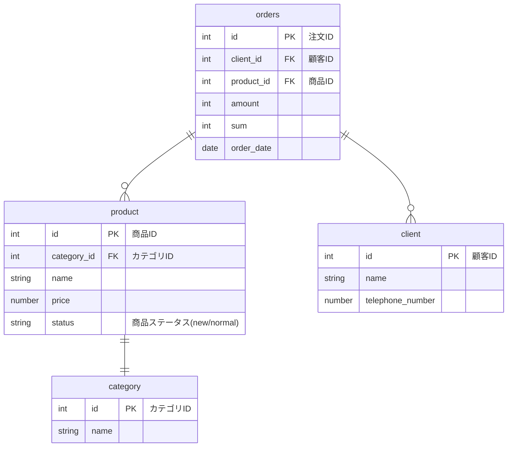

```mermaid

erDiagram
    orders ||--o{ product :""
    orders ||--o{ client :""
    product ||--|| category :""


  orders {
        int id PK "注文ID"
        int client_id FK "顧客ID"
        int product_id FK "商品ID"
        int amount
        int sum
        date order_date
    }
  product {
        int id PK "商品ID"
        int category_id FK "カテゴリID"
        string name
        number price
        string status "商品ステータス(new/normal)"
    }
  category {
        int id PK "カテゴリID"
        string name
    }
  client {
        int id PK "顧客ID"
        string name
        number telephone_number
    }
```
