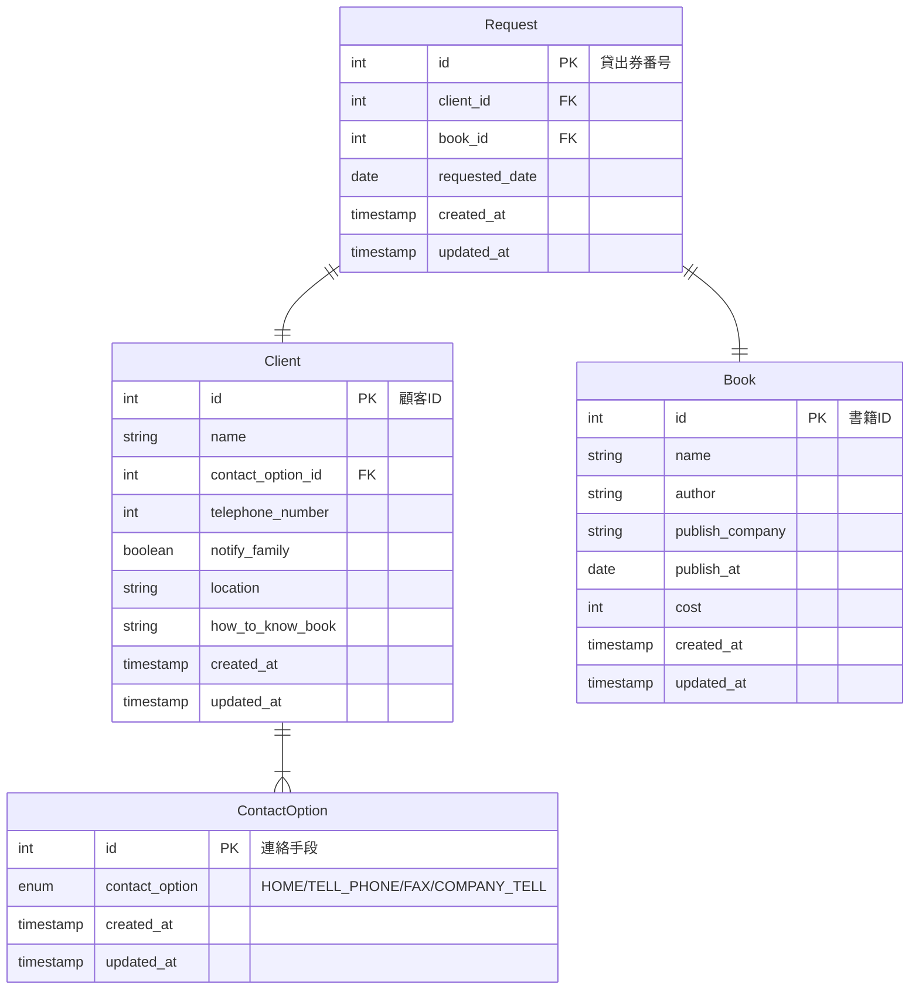

```mermaid
erDiagram
    Request ||--|| Client : ""
    Request ||--|| Book : ""
    Client ||--|{ ContactOption : ""

    Request {
        int id PK "貸出券番号"
        int client_id FK
        int book_id FK
        date requested_date
        timestamp created_at
        timestamp updated_at
    }

    Client {
        int id PK "顧客ID"
        string name
        int contact_option_id FK
        int telephone_number
        boolean notify_family
        string location
        string how_to_know_book
        timestamp created_at
        timestamp updated_at
    }

    ContactOption {
        int id PK "連絡手段"
        enum contact_option "HOME/TELL_PHONE/FAX/COMPANY_TELL"
        timestamp created_at
        timestamp updated_at
    }

    Book {
        int id PK "書籍ID"
        string name
        string author
        string publish_company
        date publish_at
        int cost
        timestamp created_at
        timestamp updated_at
    }
```
